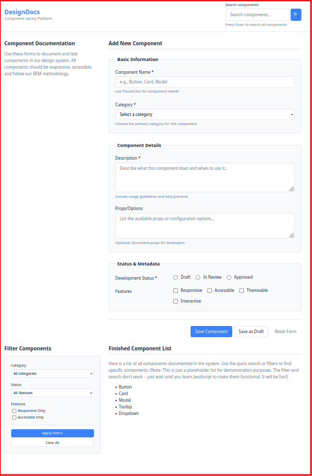

# 🎨 Design System Documentation Platform
## Comprehensive SCSS Lab

**🎯 Goal:** Build professional form components using SCSS organization, responsive design, and BEM methodology (you'll learn what this is)
**⏱️ Duration:** 1.5 - 2 hours  
**📚 What you know:** SCSS basics (variables, nesting, mixins), CSS fundamentals, HTML semantics

---

## 🌟 Your Mission

You're a front-end developer at **DesignDocs**, a startup that helps design teams document their component libraries. The company is scaling fast and needs a professional component documentation platform.

**Your task:** Transform the unstyled HTML form components into a polished, responsive design system that other developers will use as a reference.



---

## 🚀 Quick Start

1. **Install dependencies**:
   ```bash
   npm install
   ```

2. **Start the build process**:
   ```bash
   npm run watch
   ```
   *Keep this running! It auto-compiles your SCSS as you save files.*

3. **Open the HTML file**:
   Open `index.html` in your browser to see the unstyled version

4. **Review the requirements**:
   Check `design-docs/requirements.md` for detailed component specifications

5. **Start coding**:
   Edit `scss/main.scss` following the guided comments

6. **Link your compiled CSS**:
   After your first compilation, uncomment the CSS link in `index.html`:
   ```html
   <link rel="stylesheet" href="css/styles.css">
   ```

---

## 📁 Project Structure

```
design-system-forms/
├── index.html              # Your HTML (already complete)
├── scss/
│   └── main.scss           # Your SCSS workspace (guided comments)
├── css/
│   └── styles.css          # Auto-generated (don't edit)
├── design-docs/
│   └── requirements.md     # Detailed specs and visual goals
└── package.json            # Build configuration
```

---

## 🎯 Learning Objectives

By completing this lab, you'll practice:

### **Component-Based Thinking**
- Organize CSS using BEM methodology
- Create reusable patterns with SCSS
- Structure code for maintainability and team collaboration

### **Responsive Design Mastery**
- Build mobile-first responsive layouts
- Use breakpoints effectively
- Ensure forms work well on all device sizes

### **Professional Form Development**
- Style complex forms with multiple input types
- Implement proper accessibility patterns
- Create consistent, polished user interfaces

### **SCSS Organization**
- Use variables for design consistency
- Create mixins for reusable patterns
- Organize code following professional patterns

---


## 🏗️ What You'll Build

### **Site Header**
- Responsive branding section
- Integrated search form with proper accessibility
- Clean, professional layout that adapts to screen size

### **Component Documentation Form**
- Multi-section form with fieldsets and legends
- All input types: text, select, textarea, radio, checkbox
- Proper validation states and error handling
- Responsive layout that works on mobile and desktop

### **Filter Sidebar**
- Compact filtering interface
- Different visual treatment from main form
- Responsive positioning (sidebar on desktop, stacked on mobile)

### **Complete Design System**
- Consistent color palette and typography
- Professional spacing and layout
- Accessible focus states and interactions
- Polished animations and hover effects

---

## 🏗️ Side Note: The BEM Approach

This project is using the **BEM** (Block, Element, Modifier) approach to organize CSS.

**What is BEM?** BEM is one popular way to organize CSS class names. It's not the only way, but it's helpful for keeping styles organized, especially in team projects.

### **The BEM Pattern**
```css
/* Block - A standalone component */
.search-form { }

/* Element - A part of the block */
.search-form__input { }
.search-form__button { }

/* Modifier - A variation of the block or element */
.search-form__button--primary { }
```

### **Why BEM Can Be Helpful**
- **Clear relationships**: You can see which styles belong together
- **Avoid conflicts**: Specific names prevent accidental style overrides
- **Easy to find**: Looking for button styles? Check `.component-form__button`
- **Team-friendly**: Other developers understand the structure

### **How to Apply BEM**
```html
<!-- The HTML is already structured this way -->
<form class="component-form">
  <div class="component-form__group">
    <input class="component-form__input">
    <button class="component-form__button component-form__button--primary">
```

```css
/* Your SCSS would look like this */
.component-form {
  /* Form container styles */
  
  &__group {
    /* Group styles */
  }
  
  &__input {
    /* Input styles */
  }
  
  &__button {
    /* Base button styles */
    
    &--primary {
      /* Primary button variation */
    }
  }
}
```

---

## 📝 Your Workflow

### **Phase 1: Foundation (15-20 minutes)**
1. Define your design tokens (colors, fonts, spacing)
2. Create base styles and reusable mixins
3. Set up responsive breakpoints

### **Phase 2: Layout Components (20-25 minutes)**
1. Style the header, main content, and footer
2. Create responsive grid layouts
3. Establish visual hierarchy

### **Phase 3: Form Components (45-60 minutes)**
1. Style all form inputs with consistent patterns
2. Create accessible form groups and fieldsets
3. Build button variations and form actions
4. Implement responsive form layouts

### **Phase 4: Polish & Responsive (15-20 minutes)**
1. Add hover effects and transitions
2. Test and refine responsive breakpoints
3. Ensure accessibility and focus states work properly

---

## 🛠️ Available Commands

- `npm run watch` - Auto-compile SCSS as you work (recommended)
- `npm run build` - Compile once and stop
- `npm run test-progress` - Check your styling progress with automated tests
- `npm install` - Install the SCSS compiler

---

## 🆘 Getting Unstuck

**SCSS won't compile?**
- Make sure `npm run watch` is running
- Check for syntax errors (missing semicolons, unclosed brackets)
- Restart the watch command if needed

**Design doesn't look professional?**
- Focus on consistent spacing first
- Use fewer colors, but use them consistently
- Ensure sufficient contrast between text and backgrounds
- Add subtle transitions and hover effects

**Really stuck and need inspiration?**
- There's a complete reference implementation in `scss/_complete-reference.scss`
- **Try your own approach first!** The learning happens in the struggle
- Only peek at the reference if you're completely blocked
- Use it to understand patterns, not to copy code directly

**Want to check your progress?**
- Run `npm run test-progress` to see which sections are complete
- Tests check for custom styling presence, not specific design choices
- Great way to track your progress and celebrate wins!

---

**Ready to build something awesome?** Open `design-docs/requirements.md` and follow the design to get started! 🚀
