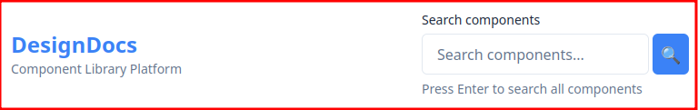
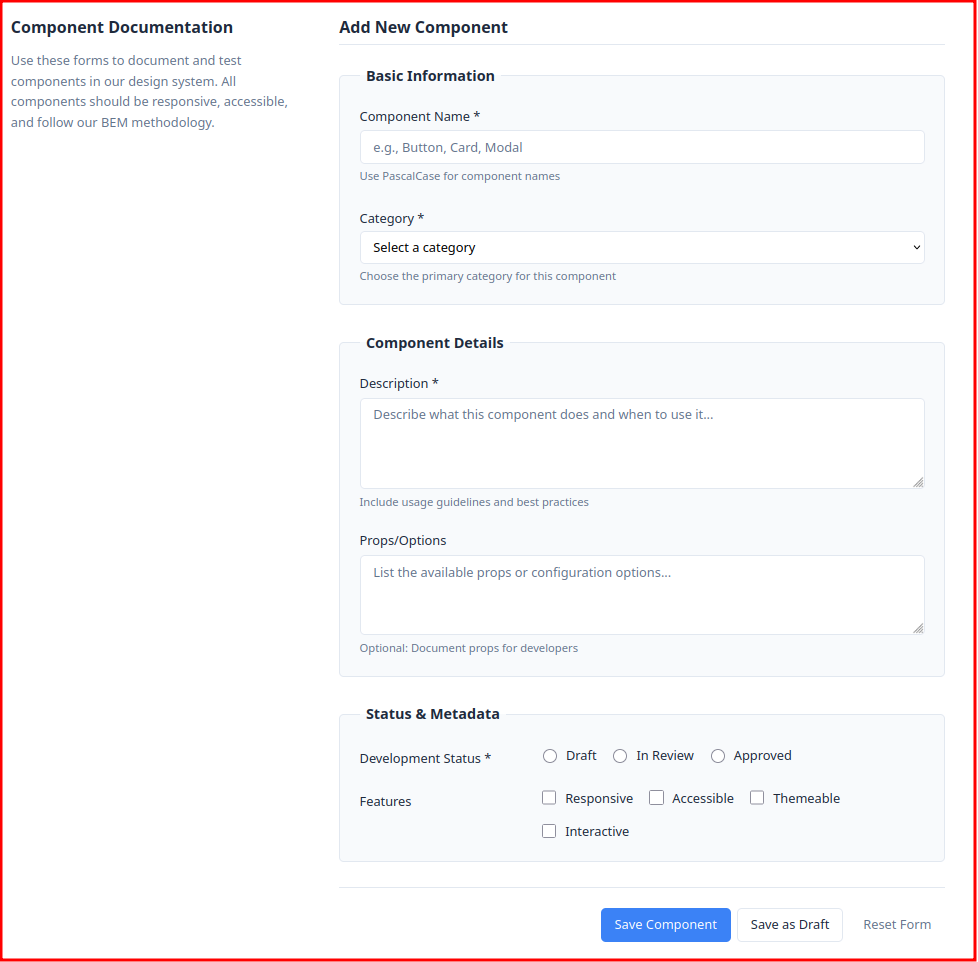
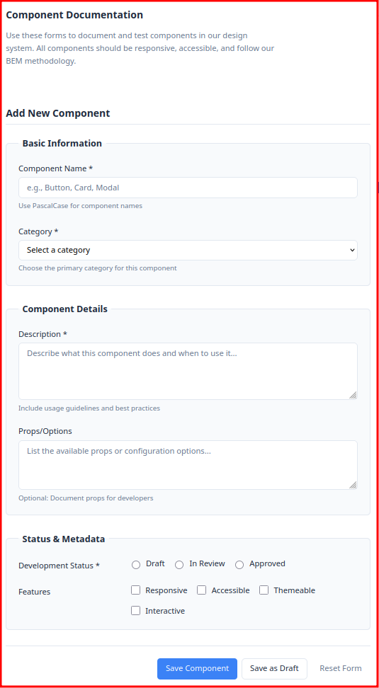
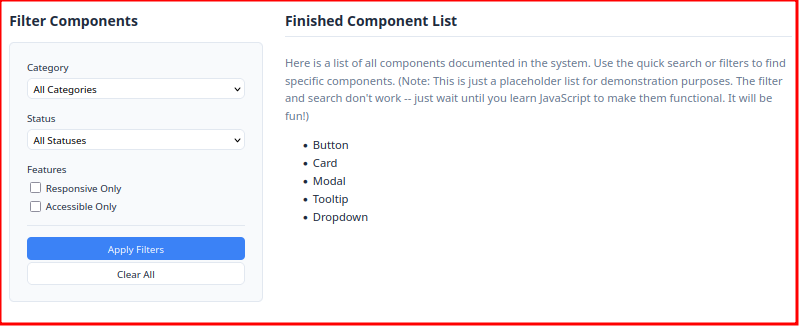

# Design System Documentation Platform
## Component Requirements & Visual Reference

---

## 📋 Project Overview

You're building form components for **DesignDocs**, a platform that helps design teams document their component libraries. The forms need to be professional, accessible, and responsive - other developers will use these patterns as examples.

### Your Mission
Transform the unstyled HTML into a polished, responsive form system using SCSS and BEM methodology.

---

## 🎯 Component Requirements

### 1. Site Header (`site-header`)
**Purpose**: Branding and quick search access
- **Desktop**: Horizontal layout with branding on left, search on right
- **Mobile**: Stacked layout, search below branding  
- **Elements**: Brand title + subtitle, integrated search form
- **Styling**: Clean, professional header with proper spacing

---

### 2. Quick Search Form (`search-form`)
**Purpose**: Fast component search in header
- **Layout**: Inline form (label, input, search button)
- **Features**: Search icon in button, hint text below
- **Responsive**: May stack vertically on very small screens
- **Accessibility**: Proper labeling, focus states

**🖼️ Visual Reference:**

---

### 3. Main Documentation Form (`component-form`)
**Purpose**: Detailed component documentation entry
- **Structure**: Multiple fieldsets with semantic grouping
- **Input Types**: Text, select, textarea, radio groups, checkbox groups
- **Layout**: Single column on mobile, some inline groups on desktop
- **Features**: Required field indicators, hint text, error message areas
- **Validation**: Visual states for errors (red borders, error text)

**Form Sections:**
- **Basic Information**: Component name, category
- **Component Details**: Description, props documentation  
- **Status & Metadata**: Development status (radio), features (checkboxes)
- **Actions**: Primary, secondary, tertiary button styles

**🖼️ Visual Reference:**

---

### 4. Filter Sidebar (`filter-sidebar`)
**Purpose**: Component filtering interface
- **Desktop**: Sidebar alongside main content
- **Mobile**: Below main content, full width
- **Style**: Distinct from main form (background color, border, or card styling)
- **Content**: Compact filter form with dropdowns and checkboxes

**🖼️ Visual Reference:**

---

## 🎨 Design Specifications

### Color Palette
Design your own cohesive color scheme including:
- **Primary color**: For main actions, focus states
- **Secondary color**: For secondary actions, accents
- **Neutral grays**: Text, borders, backgrounds (3-4 shades)
- **Semantic colors**: Error (red), success (green), warning (yellow)
- **Background**: Main page background

### Typography Scale
Choose and implement:
- **Font family**: Professional, readable font stack
- **Sizes**: Small (14px), base (16px), large (18px), heading sizes
- **Weights**: Regular, medium, bold as needed
- **Line heights**: Comfortable reading (1.4-1.6 for body text)

### Spacing System
Use consistent spacing:
- **Micro**: 4px (fine adjustments)
- **Small**: 8px (tight spacing)
- **Medium**: 16px (standard spacing)
- **Large**: 24px (section spacing)  
- **XL**: 32px+ (major section breaks)

### Responsive Breakpoints
- **Small**: 576px (large phones)
- **Medium**: 768px (tablets)
- **Large**: 992px (desktop)

---

## 📱 Responsive Behavior

### Mobile (< 576px)
- Header: Stacked layout
- Forms: Single column, full width inputs
- Buttons: Stacked vertically
- Sidebar: Below main content

### Tablet (576px - 992px) 
- Header: May stay horizontal if fits
- Forms: Single column, but with better proportions
- Some inline groups may be appropriate

### Desktop (992px+)
- Header: Horizontal layout
- Forms: May have inline groups (radio buttons, checkboxes)
- Sidebar: True sidebar positioning
- Buttons: Inline where appropriate

---

## ♿ Accessibility Requirements

### Form Accessibility
- All inputs have proper labels
- Required fields marked with `*` and `aria-required`
- Error messages connected with `aria-describedby`
- Fieldsets group related inputs with meaningful legends
- Focus styles visible and consistent

### Interactive Elements
- All buttons, inputs, and links have clear focus indicators
- Click/touch targets are at least 44px for mobile
- Color is not the only way to convey information
- Sufficient color contrast (4.5:1 minimum)

### Semantic Structure
- Proper heading hierarchy (h1, h2, h3)
- Forms use `<form>`, `<fieldset>`, `<legend>` appropriately
- ARIA roles and properties where helpful

---

## 🛠️ Technical Requirements

### SCSS Organization
- Use BEM methodology for all CSS classes
- Organize with clear sections (variables, mixins, components)
- Use SCSS variables for all repeated values
- Create reusable mixins for common patterns

### Code Quality
- Clean, readable SCSS code
- Consistent naming conventions
- Proper nesting (no more than 3 levels deep)
- Comments explaining complex patterns

### Browser Support
- Modern browsers (Chrome, Firefox, Safari, Edge)
- CSS Grid and Flexbox are fine to use
- No need to support Internet Explorer

---

## ✅ Success Criteria

**Visual Polish**
- Design feels professional and cohesive
- Forms look trustworthy and well-organized
- Consistent spacing and typography throughout

**Responsive Design**
- Works well on mobile phones, tablets, and desktop
- Layout adapts appropriately at all screen sizes
- Text remains readable, buttons remain clickable

**Accessibility**
- Keyboard navigation works throughout
- Screen readers can understand form structure
- Focus states are clearly visible
- Color contrast meets standards

**Code Quality**
- SCSS follows BEM methodology
- Code is organized and maintainable
- Design system tokens are used consistently
- Compiles without errors

---

## 🖼️ Visual Reference

### Final Desktop Example

---

Ready to build? Start with the SCSS file structure and work through each component systematically!
